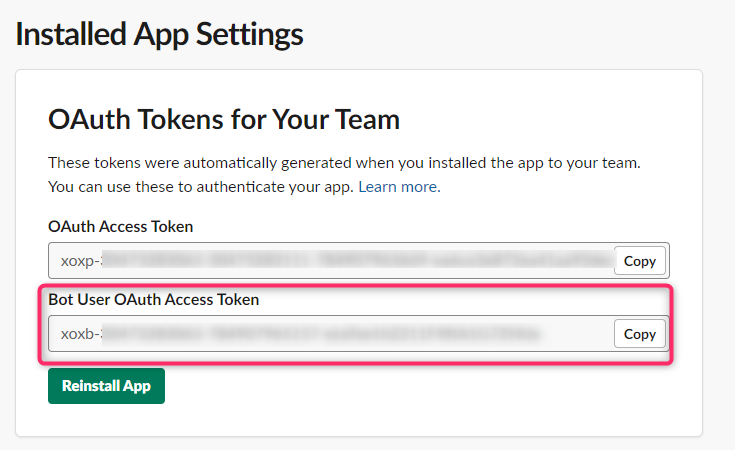
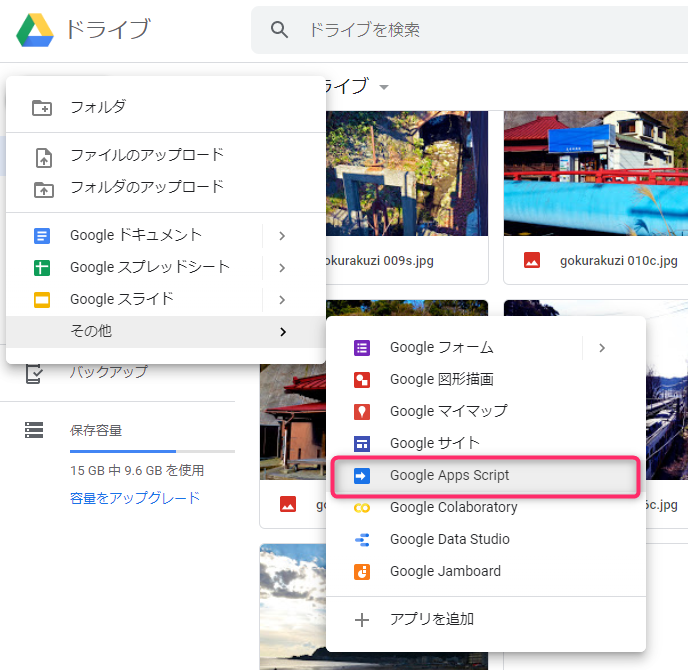
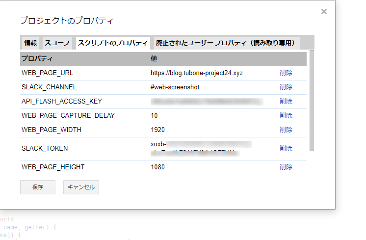

# web-screenshot-to-slack-gas


[](LICENSE)
[](https://github.com/RichardLitt/standard-readme)

> WebScreenshot with Google Apps script and [API FLASH](https://apiflash.com/)

This app is take screenshots of Web pages with GAS(Google Apps Script) and send images to Slack channel with Slack API.

## Table of Contents

- [Background](#background)
- [Install](#install)
- [Usage](#usage)
- [Demos](#demos)
- [Contributing](#contributing)
- [License](#license)

## Background

I should need to get a screen capture of my website and paste it into Slack channels.

Because I wanted to do it easily, instead of setting up a dedicated server, I make it as FaaS using Google Apps Script (GAS).

And also, I want to use TypeScript because of a Test and Type lint, so using with `clasp` referenced by [howdy39/gas-clasp-starter](https://github.com/howdy39/gas-clasp-starter) 

## Install

### Precondition

- [Node.js (more v10.15.x)](https://nodejs.org/en/)
- [google/clasp](https://github.com/google/clasp)
  - `npm install @google/clasp -g`
- Google Account

### Create API FLASH Website Screenshot API AccessKey

This tool needs to API FLASH Access key because of taking of a Web page screenshot.

Visit [https://apiflash.com](https://apiflash.com/) and signup your account.

When create your account, visit [Documentation page](https://apiflash.com/documentation), check your access key, and note this!


### Create Slack API

Visit [https://api.slack.com/apps?new_app=1](https://api.slack.com/apps?new_app=1) and Create New app


Next, you add `BOT` features because need to `Bot TOKEN`


And also, change Basic Information with API, install this app to your workspace.


Additionally, Change your Slack bot Name.


Finally, you can check your app's BOT users OAuth Access TOKEN, note this!!



### Create GAS Project

First you create a empty GAS project from Google Drive.



When you create a GAS project, enter name and note `script ID` include the URL. (Red Underline)


Next, enter your `script ID` to `.clasp.json`

```json
{
  "scriptId": "FIXME: This value is your script ID",
  "rootDir": "dist"
}
```

### Set environment variables with Script Properties

Set your API FLASH TOKEN, Slack API TOKEN, and some variables with Script Properties




Set variables below. 

```ini
SLACK_TOKEN="Your Slack TOKEN Required"
API_FLASH_ACCESS_KEY="Your API FLASH Access Key Required"
WEB_PAGE_URL="Your Web pages URL, default value is Author's Blog"
SLACK_TITLE="Slack Message title, default value is Test"
WEB_PAGE_WIDTH="Screenshot Page Width, default is 1920"
WEB_PAGE_HEIGHT="Screenshot Page Height, default is 1080"
WEB_PAGE_CAPTURE_DELAY="This value is delay time between access your page and take a screenshot, default is 10 sec"
SLACK_CHANNEL="Slack channel which Send a screenshot, default is #general"
```

### Install dependencies

Use `npm`, install dependencies.

```
npm install
```

## Usage

### Build App

Execute the command below, build script file using with webpack and create script files under `dist` directory.

```
npm run build
```

### Push App

Before push app, you need to change GA user setting which enable API.

[https://script.google.com/home/usersettings](https://script.google.com/home/usersettings)

Push App.

```
clasp login  # only first access
clasp push
```

## Demos

Run `main` function , send Slack your web page screenshot.


## Contributing

See [the contributing file](CONTRIBUTING.md)!

PRs accepted.

Small note: If editing the Readme, please conform to the [standard-readme](https://github.com/RichardLitt/standard-readme) specification.

## License

[MIT © tubone.](LICENSE)
